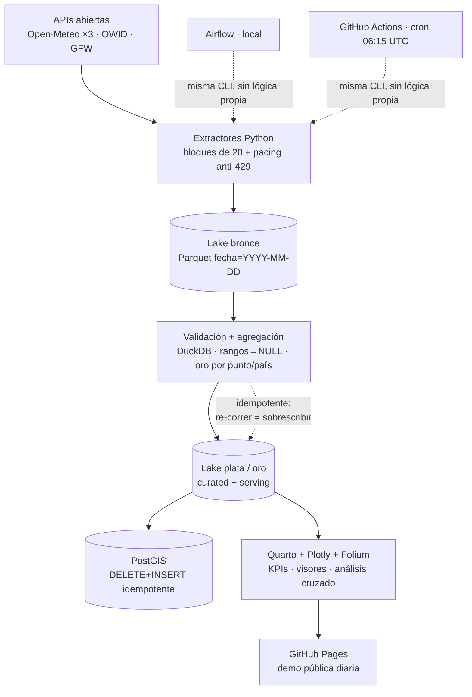

# Observatorio Ambiental — Plataforma de Datos End-to-End

> 🌍 **Demo en vivo:** https://luisangelquezada88-netizen.github.io/observatorio-ambiental/

El presente repositorio contiene un **observatorio ambiental** que monitorea a diario **150 puntos del planeta (60% Latinoamérica)** y mide indicadores como **PM2.5 y calidad del aire (categorías OMS), temperatura, precipitación, viento y caudal de ríos**, con tableros geográficos interactivos, tarjetas de indicadores y análisis cruzado clima-contaminación.

Está respaldado por una *arquitectura de datos end-to-end* con automatización de ingesta y almacenamiento: extractores resilientes anti-rate-limit, lago Parquet particionado como fuente de verdad, validación y agregación con DuckDB, carga idempotente a **PostGIS**, orquestación con **Apache Airflow** y despliegue diario totalmente automático a GitHub Pages vía **GitHub Actions** — con **costo operativo cero**.

*Stack:* Python · DuckDB · PostGIS · Airflow · Parquet · Quarto + Plotly/Folium · Docker · GitHub Actions.
Detalle del plan en [`plan.md`](plan.md).

## Indicadores

| Indicador | Unidad | Fuente (API) | Cómo funciona | Frecuencia |
|---|---|---|---|---|
| PM2.5 media / máx diaria | µg/m³ | Open-Meteo Air Quality (CAMS/Copernicus) | Promedio y pico diario de partículas finas (las que entran al pulmón); base de la categoría OMS | Diaria |
| PM10 media | µg/m³ | Open-Meteo Air Quality | Partículas gruesas (polvo, polen, hollín) | Diaria |
| Ozono (O₃) | µg/m³ | Open-Meteo Air Quality | Contaminante fotoquímico; sube con calor y sol | Diaria |
| Dióxido de nitrógeno (NO₂) | µg/m³ | Open-Meteo Air Quality | Trazador de tráfico y combustión | Diaria |
| AQI US máx | Índice 0–500 | Open-Meteo Air Quality | Índice compuesto de EE. UU.; 100 = límite saludable | Diaria |
| Categoría OMS | Etiqueta | Derivada de PM2.5 | Buena → Moderada → Dañina → Peligrosa (guía OMS 2021, 24h ≤ 15 µg/m³) | Diaria |
| Temp. máx / mín / media | °C | Open-Meteo Forecast + ERA5 | Resumen térmico del día por punto | Diaria |
| Precipitación | mm/día | Open-Meteo Forecast + ERA5 | Lluvia acumulada del día | Diaria |
| Viento máx / ráfaga | km/h | Open-Meteo Forecast + ERA5 | Viento sostenido y ráfaga máxima | Diaria |
| Caudal de río | m³/s | Open-Meteo Flood (GloFAS) | Caudal de celda ~10 km; fiable en grandes cuencas, orientativo en ciudades | Diaria |
| CO₂ total / per cápita | Mt / t | Our World in Data | Emisiones anuales; se publican con ~1 año de retraso | Anual (en pausa) |
| Pérdida de cobertura arbórea | ha/año | Global Forest Watch | Hectáreas de bosque perdidas por país | Anual (en pausa, requiere key) |

## Arquitectura



## Inicio rápido (Etapa 0)

```bash
cp .env.example .env
docker compose up -d        # o: make up
docker compose ps           # 4 servicios en verde
```

| Servicio | URL | Credenciales dev |
|---|---|---|
| Airflow | http://localhost:8080 | admin / admin |
| PGAdmin | http://localhost:5050 | admin@local.dev / admin |
| PostGIS | localhost:5433 | ambiental / ambiental_dev |
| MinIO consola | http://localhost:9001 | minioadmin / minioadmin123 |

## Pipeline diario (modo dual)

```bash
# Local (misma CLI que Airflow y Actions):
python -m src.extract.openmeteo_meteorologia --fecha 2025-01-15
python -m src.extract.openmeteo_calidad_aire --fecha 2025-01-15
python -m src.extract.openmeteo_hidrologia --fecha 2025-01-15
python -m src.transform.indicadores --fecha 2025-01-15
python -m src.load.postgis --fecha 2025-01-15   # requiere compose en verde
pytest tests/ -q
```

Fuentes mensuales:

```bash
python -m src.extract.owid_co2 --year 2023
python -m src.extract.gfw_deforestacion --year 2023  # sin GFW_API_KEY: partición vacía (D-03)
```

Dashboard local (requiere [Quarto](https://quarto.org)):

```bash
quarto render dashboard --to html   # o: make dashboard
```

## Estructura

```
src/config/puntos_monitoreo.py  # 150 puntos curados (91 LatAm + 59 mundo)
src/extract/_http.py            # HTTP resiliente (Retry-After + backoff)
src/extract/openmeteo_*.py      # Aire, clima, agua (CLI --fecha, idempotentes)
src/extract/gfw_deforestacion.py + owid_co2.py  # Fuentes anuales
src/transform/indicadores.py    # Bronce→plata→oro (DuckDB + fallback pandas)
src/load/postgis.py             # DELETE+INSERT por fecha a PostGIS
dags/                           # Solo envuelven src/ (diaria, mensual, dashboard)
sql/01_schema_postgis.sql       # Tablas + GiST (auto-aplicado en compose)
sql/02_validaciones.sql         # 7 chequeos de calidad re-ejecutables
dashboard/                      # Tablero + 3 pilares + Datos + Acerca de (Quarto)
lake/                           # Fuente de verdad: raw/curated/serving (gitignored)
tests/test_pipeline.py          # Smoke: idempotencia + 150 puntos + compilación
scripts/smoke_qmd.py            # Verifica chunks del dashboard sin Quarto
docs/decisiones.md              # Bitácora D-01…D-10 (cada anomalía documentada)
```
